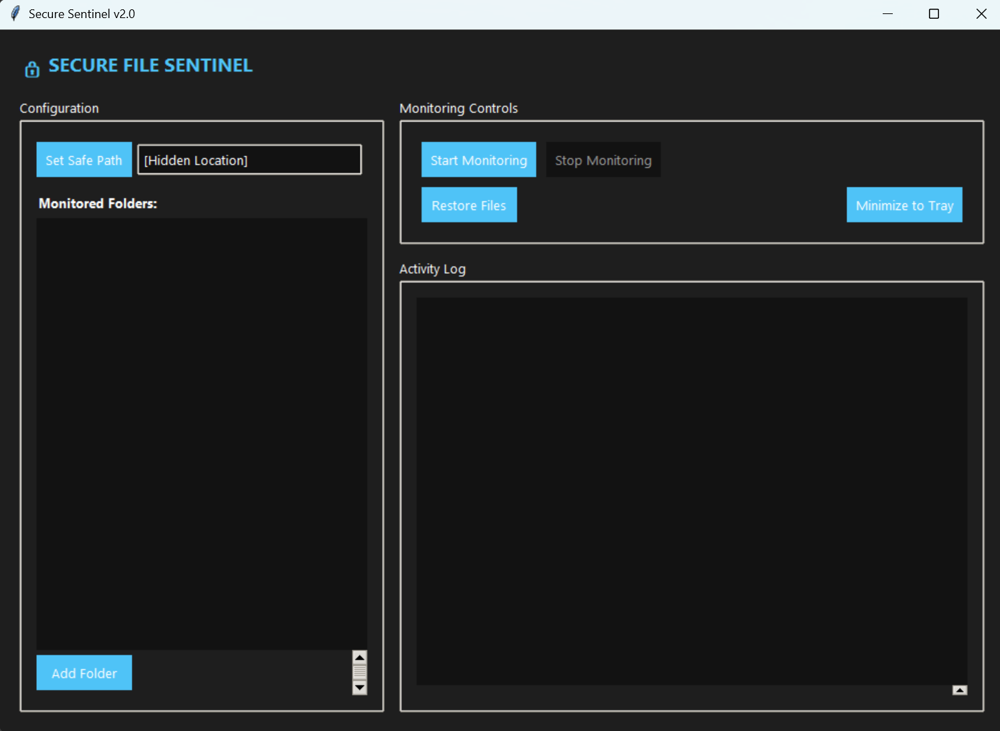
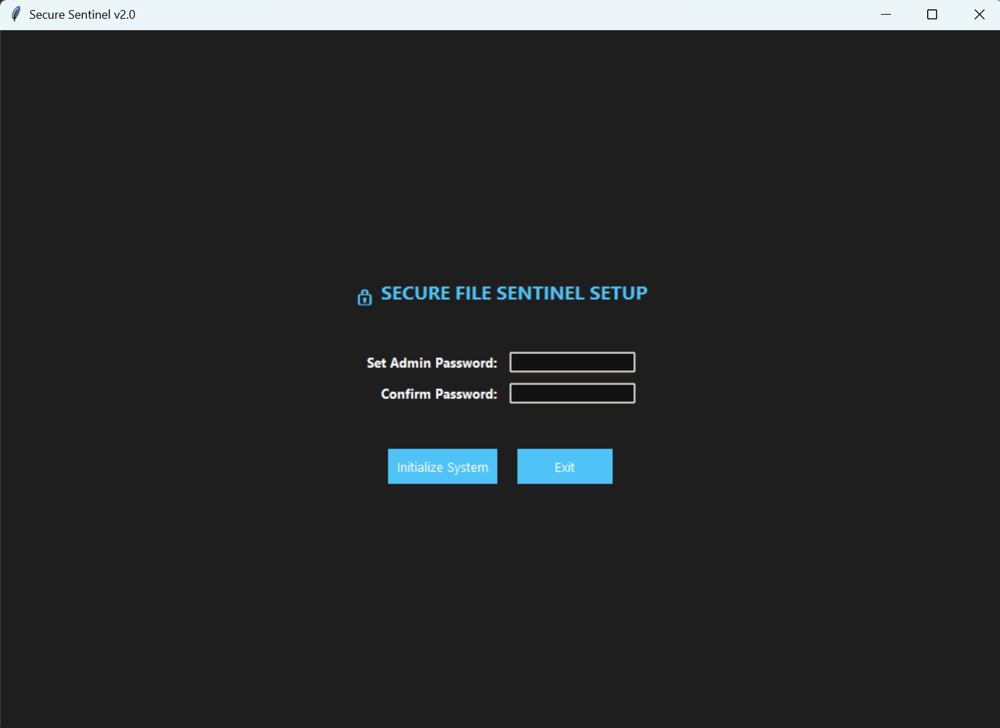
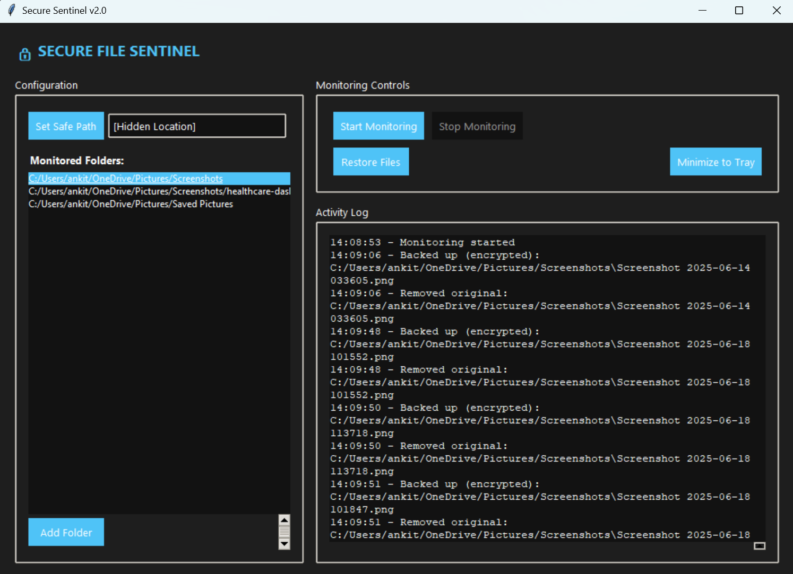
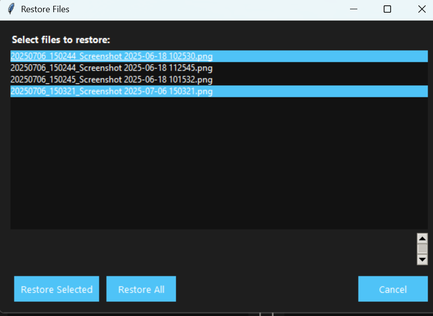

# 🔒 Secure Sentinel - ONE CLICK SYSTEM MONITORING TOOL 
*(Portable executable - No installation needed!)*  

 

## 🚀 Key Features
- **Real-time File Monitoring**: Instant detection of new/changed/deletion/copying/creatation files(any type of modification)
- **Military-Grade Encryption**: AES-256 via Fernet with PBKDF2 key derivation
- **Zero-Knowledge Architecture**: Your password never leaves your device(stored encrypted)
- **Cross-Platform Stealth**: Hidden operation on Windows/macOS/Linux
- **Secure Backup System**: Automatic encrypted backups with timestamping
- **Tray Mode**: Minimal footprint with system tray integration

## 📥 Get Started in 30 Seconds
1. **Download**:  
   → [🔗 Latest Version Here](https://drive.google.com/drive/folders/1nz2yW5ZtqJlxgTXkmrb8P8FwTVX6y8h0?usp=drive_link)  
   *(Look for `SecureSentinel_v2.0.zip`)*

2. **Extract** and run `SecureSentinel.exe`  
3. **Set password** when prompted

 💡 Pro Tip: Right-click → "Pin to taskbar" for quick access!
 
 ⚠️ **First run?** You’ll be asked to set a password - don’t lose it!

## 🛠️ How It Works
**First Run:** Set your master password

**Add Folders:** Select directories to monitor

**Activate:** Files are encrypted when modified/created

**Restore:** Decrypt backups via the GUI

## 🖥️ See It in Action
| Setup Password | Monitor Folders | Restore Files |
|----------------|-----------------|---------------|
|  |  |  |

## 📦 Installation
### Prerequisites
- Python 3.8+
- Supported OS: Windows 10/11, macOS 10.15+, Linux (kernel 5.4+)

## ❓ **FAQ**  
**Q:** *Where are backups stored?*  
A: In a hidden folder (`C:\Users\YourName\.secure_backups` on Windows)  

**Q:** *Can I use it on multiple PCs?*  
A: Yes! Copy the entire `build` folder to another computer.  

**Q:** *Is my password recoverable?*  
A: ❌ No - store it securely (e.g., password manager). 

**Q:** *Is this 100% secure?*  
A: While using industry-standard encryption,   
always:  
1.Use strong passwords.  
2.Keep backups offline.  
3.Never share your vault location.  

**Q:** *Can I recover lost passwords?*  
A: No - design is zero-knowledge. Keep your password secure!

## 🔧 **For Developers**  
*Built with Python + cx_Freeze. To rebuild:*  
bash
`build.bat  # Creates fresh 'build' folder`

## 🔄 How Files Are Protected
```mermaid
sequenceDiagram
    User->>+Secure Sentinel: Adds folder
    Secure Sentinel->>+File System: Monitors changes
    File System->>+Secure Sentinel: Detects modification
    Secure Sentinel->>+Encryption: Locks file (AES-256)
    Encryption->>+Vault: Stores encrypted copy
    Vault->>+File System: Deletes original

